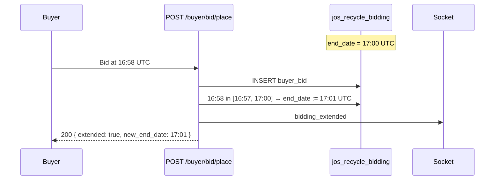
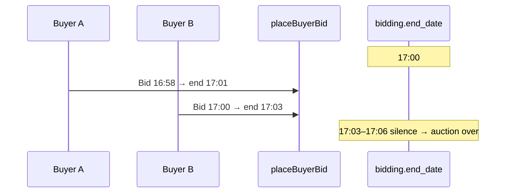
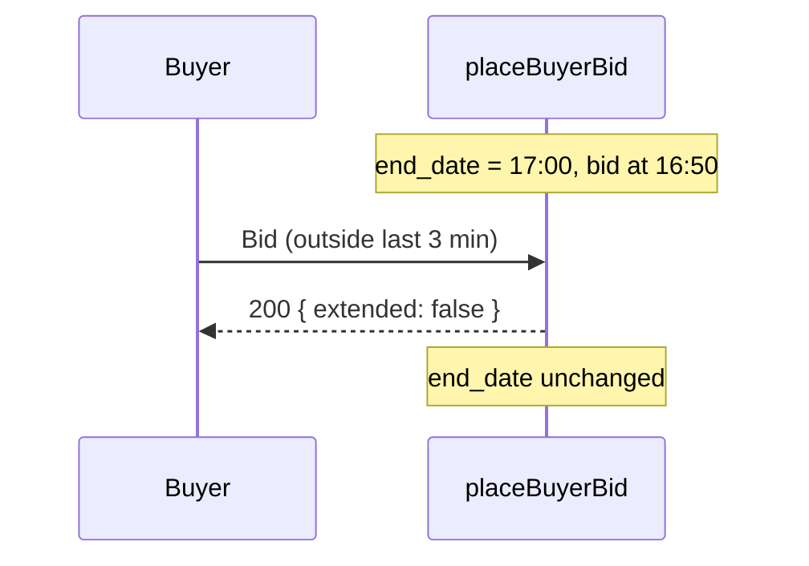

# Bid Time Extension (Anti-Sniping) — Full Specification

**Document version:** 1.2  
**Date:** 2026-05-18  
**Status:** Ready for client/product sign-off → then implementation  
**Platforms:** GreenBidz / 101lab (`101recycle-greenbidz-backend` + `101lab-2` frontend)

**Revision history**

| Version | Date | Changes |
|---------|------|---------|
| 1.0 | 2026-05-18 | Initial specification |
| 1.1 | 2026-05-18 | Grace period, timezone display, countdown fallback, `end_date` sanitization, extension history UI, admin v1 policy, seller email draft (phase 2), `original_end_date` in API |
| 1.2 | 2026-05-18 | Grace/extension worked example, concurrent bid serialization, socket subscribers, single notification pipeline, timezone midnight policy, client presentation pack (§3.5) |

---

## 1. Executive summary

The client requests **automatic auction time extension** when a buyer places a bid in the **last 3 minutes** before the scheduled bidding end time.

| Parameter | Proposed default (pending client confirmation) |
|-----------|-----------------------------------------------|
| Extension window | Last **3 minutes** before `end_date` |
| Extension amount | Reset clock to **3 minutes from bid time** (soft close) |
| Applies to | Timed bidding / auction listings (`jos_recycle_bidding`) |
| Winner selection | **Unchanged** — seller still manually accepts winner after bidding ends |

This document defines behavior, edge cases, API/DB/UI changes, and test cases so implementation is unambiguous.

---

## 2. Business goal

| Problem | Solution |
|---------|----------|
| Last-second bids (“sniping”) give other buyers no time to respond | Late bids trigger a short extension |
| Perceived unfairness at auction close | Visible countdown updates for all users |
| Stale `end_date` on open pages | Real-time or refetched end time after extension |

**Out of scope for this feature:**

- Auto-selecting a winner when time expires  
- Changing payment, pickup, or email flows  
- Extending inspection schedules  

---

## 3. Client requirement (verbatim intent)

> If a bid is made in the **last 3 minutes** of the bid end time, the time will be **extended by 3 minutes**.

### 3.1 Interpretations (must confirm with client)

| ID | Rule | Example: scheduled end 5:00 PM, bid at 4:58 PM |
|----|------|--------------------------------------------------|
| **A — Extend BY 3** | `new_end_date = old_end_date + 3 minutes` | New end **5:03 PM** |
| **B — Reset TO 3 min** (recommended) | `new_end_date = bid_time + 3 minutes` | New end **5:01 PM** |

**Recommendation:** **B (reset TO 3 minutes from bid)** — standard eBay-style soft close. Each qualifying bid resets the clock.

### 3.2 Additional questions for sign-off

| # | Question | Default if no answer |
|---|----------|----------------------|
| 1 | Extend BY 3 or reset TO 3 minutes from bid? | Reset TO 3 min (B) |
| 2 | Can extension repeat on every late bid? | Yes |
| 3 | Maximum number of extensions? | Unlimited (v1) |
| 4 | Maximum total auction length cap? | None (v1) |
| 5 | Apply to `make_offer` and `fixed_price`, or only `isAuction = true`? | Only when `isAuction = true` |
| 6 | Extend on bid **update** (revised amount) or only **new** bid row? | New bid + material update in window |
| 7 | Notify seller on each extension? | Yes — in-app + socket in v1; email in phase 2 (§18) |
| 8 | Grace period after `end_date` for late requests? | **5 seconds** server-side (§3.3) |

### 3.3 Grace period (network latency)

**Problem:** A bid submitted at `end_date - 0.5s` may arrive at the server at `end_date + 1s` due to network latency.

| Policy option | Behavior |
|---------------|----------|
| **Strict (reject at end)** | `T_now > end_date` → reject; no extension |
| **Grace buffer (recommended v1)** | Treat bidding as open while `T_now <= end_date + GRACE_SECONDS` |

**v1 default:** `GRACE_SECONDS = 5` (configurable).

| Server receive time (`T_arrival`) | Bid accepted? | Extension eligible? |
|-----------------------------------|---------------|---------------------|
| `T_arrival <= end_date` | Yes (if other checks pass) | Yes, if also in `[end_date - 3 min, end_date]` |
| `end_date < T_arrival <= end_date + 5s` | Yes (**grace** — late network arrival) | **No** — extension requires `T_arrival <= end_date` |
| `T_arrival > end_date + 5s` | **Reject** “Bidding has ended” | No |

**Extension window rule (with grace):** Extension is evaluated against `end_date` **locked at the start of the transaction** (before this bid’s update). Grace allows late *arrival* only; it does **not** grant an extension after the nominal close.

**Worked example** (nominal `end_date` = 17:00 UTC, grace = 5s):

| Event | `T_arrival` | Accept bid? | Extend? | New `end_date` |
|-------|-------------|-------------|---------|----------------|
| Bid in window | 16:58 | Yes | Yes | 17:01 (`T_arrival + 3 min`) |
| Bid at nominal end | 17:00 | Yes | Yes | 17:03 |
| Bid in grace (late arrival) | 17:04 | Yes | **No** | Stays 17:03 (or prior) |
| Bid after grace | 17:06 | **Reject** | No | — |

**Note on client timestamps:** v1 uses **server receive time** (`T_arrival`) as the authority for both acceptance and extension. Optional v2: accept `client_submitted_at` only if within skew tolerance of `T_arrival`.

**Client sign-off:** Confirm 5s grace or 0s strict.

### 3.4 Timezone display (buyer & seller UI)

| Layer | Rule |
|-------|------|
| **Storage / enforcement** | Always **UTC** in `jos_recycle_bidding.start_date` / `end_date` |
| **API** | Return ISO-8601 UTC strings; include `timezone` from listing if stored |
| **Countdown display** | Show end time in the **user’s browser local timezone** (e.g. `Intl.DateTimeFormat` / `date-fns` with user locale) |
| **Label** | Show explicit hint: “Ends {localDateTime} ({timezone abbreviation})” to avoid ambiguity |
| **Seller upload wizard** | Continue using seller’s selected `timeZone` when *creating* schedule; after save, display follows browser local + UTC in tooltip |

**Not used for enforcement:** Client clock or displayed local time — server UTC only for accept/reject.

**Cross-midnight / calendar day (product policy):** Extensions may push `end_date` past the seller’s or buyer’s local midnight (e.g. auction “ends Tuesday” becomes Wednesday 00:15 local). **v1 allows this** — there is no per-calendar-day cap. Confirm with client if marketing copy promises “same-day only” end.

---

### 3.5 Client & product sign-off pack

**Ready to present (no code required):**

| Topic | Section |
|-------|---------|
| Extension algorithm (A vs B; B recommended) | §3.1, §5.2 |
| Grace period (5s, arrival vs extension) | §3.3 |
| API response + `server_time` | §8.1 |
| Socket event + subscribers | §8.2 |
| Timezone (UTC enforce, local display) | §3.4 |
| User messaging (EN/ZH drafts) | §18 |
| Tests & rollout | §13, §15 |

**Must confirm with client before phase 1 code** (defaults in parentheses):

| # | Question | Default |
|---|----------|---------|
| 1 | Extend **BY** 3 min or reset **TO** 3 min from bid? | Reset TO 3 min (B) |
| 2 | Repeat extensions on every qualifying late bid? | Yes |
| 3 | Max extensions or total auction length cap? | Unlimited (v1) |
| 4 | Auction-only (`isAuction`) or all listing types? | Auction-only |
| 5 | Grace **5s** or **0s** strict? | 5s |
| 6 | Seller email on each extension? | Yes — phase 2 (§18); socket v1 |
| 7 | OK if extended end crosses local midnight? | Yes (v1) |

---

## 4. Current system behavior (baseline)

### 4.1 Data model

| Table | Relevant fields |
|-------|-----------------|
| `jos_recycle_bidding` | `bid_id`, `batch_id`, `start_date`, `end_date`, `status` (`pending` \| `active` \| `closed`), `currency`, `isAuction`, `type` |
| `jos_recycle_buyer_bids` | Buyer bids; `status`: `pending` \| `accepted` \| `rejected` |

### 4.2 Key flows today

```
Seller sets start/end → createBid (bidService) → end_date stored (UTC)
Buyer places bid     → placeBuyerBid (buyerBidService) → NO end_date change
Auction "ends"       → NO cron auto-close; end_date is informational unless enforced
Seller accepts       → PUT /buyer/bid/win/:batch_id/:buyer_bid_id → closed + emails
```

### 4.3 Gaps relevant to this feature

| Gap | Risk |
|-----|------|
| `placeBuyerBid` does not validate `now <= end_date` | Bids after nominal end may still save |
| `end_date` never updated after creation | Extension impossible without new logic |
| Bidding `status` often stays `pending` (not auto `active`/`closed`) | Extension rules must use **time**, not only `status` |
| UI countdown may cache old `end_date` | Buyers see wrong timer after extension |
| No `extension_count` audit | Hard to debug disputes |

---

## 5. Target behavior (normative rules)

### 5.1 Definitions

- **Extension window:** `[end_date - 3 minutes, end_date]` inclusive (bid at exactly `end_date - 3:00` qualifies).
- **Grace for bid acceptance:** `T_now <= end_date + GRACE_SECONDS` (default 5s) — see §3.3.
- **Extension duration:** Per §3.1 (reset TO 3 min recommended).
- **Bidding open:** `T_now <= end_date + GRACE_SECONDS` AND `bidding.status !== 'closed'` AND no accepted winner.
- **Bidding closed:** `T_now > end_date + GRACE_SECONDS`, OR `status === 'closed'`, OR winner `accepted`.

All times computed in **UTC** in the database; display uses existing timezone handling (`timeZone` on create, Luxon in `bidService`).

### 5.2 Extension algorithm (recommended — reset TO 3 min)

Pseudocode inside `placeBuyerBid`, **after** bid row(s) created successfully, inside a **DB transaction** with row lock on `bidding`:

```
INPUT: batch_id, bid placed at T_now (UTC)
LOAD bidding FOR UPDATE WHERE batch_id = ?

IF bidding.status == 'closed' → REJECT "Bidding closed"
IF batch has accepted winner → REJECT "Winner already selected"
IF T_now < bidding.start_date → REJECT "Bidding not started"
IF T_now > bidding.end_date + GRACE_SECONDS → REJECT "Bidding ended"

SAVE buyer bid(s)  // existing logic

WINDOW_START = bidding.end_date - 3 minutes
// Extension only when arrival is on or before nominal end (grace accepts later, does not extend)
IF T_now >= WINDOW_START AND T_now <= bidding.end_date:
    NEW_END = T_now + 3 minutes   // interpretation B
    // IF interpretation A: NEW_END = bidding.end_date + 3 minutes
    // DEFENSIVE (§5.5): NEW_END = max(NEW_END, T_now + 1 second)
    IF NEW_END <= T_now → NEW_END = T_now + 3 minutes
    UPDATE bidding SET end_date = NEW_END
    IF original_end_date IS NULL → SET original_end_date = previous end_date on first extension
    OPTIONAL: increment extension_count, append extension log
    EMIT socket: bidding_extended { batch_id, bid_id, old_end, new_end, extended_by_buyer_id }
    SET response.extended = true, response.new_end_date = NEW_END

RETURN bid + extension metadata
```

### 5.3 What does NOT happen on extension

| Action | On extension? |
|--------|----------------|
| Auto-accept winning bid | No |
| Email “You Are the Winning Bidder” | No |
| Change buyer bid `status` from `pending` | No |
| Advance batch `step` | No |
| Close bidding (`status = closed`) | No |

### 5.4 When bidding truly ends

After the final `end_date` passes with **no** qualifying bid in the last 3 minutes:

- System may optionally set `bidding.status = 'closed'` (new cron or on next API read) — **phase 2**.
- Seller still selects winner on upload **step 5** (`BiddingStep` → Accept Selected Bid).
- Buyer bids remain `pending` until seller accepts.

### 5.5 Defensive rules (`end_date` sanitization)

After computing `NEW_END`, **always** enforce before `UPDATE`:

| Rule | Action |
|------|--------|
| `NEW_END <= T_now` | Set `NEW_END = T_now + EXTEND_MINUTES` (never persist an end in the past) |
| `NEW_END < bidding.start_date` | Reject extension (invalid state); log error |
| `NEW_END` unchanged from current `end_date` | Skip update; `extended: false` |

### 5.6 Server time authority (socket desync)

- **Enforcement** always uses server UTC on every `placeBuyerBid` and (recommended) every bid-related GET.
- **UI countdown** is indicative; if socket fails or tab is backgrounded, the next API call or poll **must** realign to server `end_date`.
- Do **not** extend bidding based on client-reported time.

---

## 6. User-visible behavior

### 6.1 Buyer

| Event | UI |
|-------|-----|
| Places bid in last 3 min | Success toast: “Auction extended by 3 minutes” (i18n) |
| Countdown on listing | Updates to new `end_date` (refetch or socket) |
| Places bid after grace window | Error: “Bidding has ended” |
| Views My Bids | Still `pending` until seller accepts — unchanged |
| Extension history (v1.1) | Listing detail: “Extended 2 times · Originally ended {original} · Now ends {current}” (read-only line, not full log page) |

### 6.2 Seller

| Event | UI |
|-------|-----|
| Late bid extends time | Banner on step 5: “Auction extended — now ends {local time}” + `extension_count` |
| Originally scheduled | Show `original_end_date` vs current `end_date` when `extension_count > 0` |
| Bidding step table | Poll + socket refresh bids |
| In-app notification (v1) | Socket `bidding_extended` → toast on seller dashboard / open step 5 |
| Email (phase 2) | Template `biddingExtended` — §18 |
| Accept winner | Only after they choose; not auto-triggered by timer |

### 6.3 Admin

| v1 | v1.1 / phase 2 |
|----|----------------|
| No extension log UI | Batch detail: `extension_count`, `original_end_date`, link to extension rows |
| Cannot edit `end_date` while auction live — §19 | Override / pause extensions (v2) |

### 6.4 Extension history visibility

| Audience | v1 minimum | v1.1 recommended |
|----------|------------|------------------|
| Buyer | Updated countdown + optional one-line “Extended” badge | Same + `extension_count` in bid response |
| Seller | Step 5 banner with new end time | + “Originally scheduled for …” using `original_end_date` |
| Admin | — | `GET .../bidding/:bid_id/extensions` or embed in batch report |
| Full audit UI | Out of scope v1 | Table from `jos_recycle_bidding_extensions` (phase 2) |

---

## 7. Sequence diagrams

### 7.1 Happy path — single extension



### 7.2 Multiple extensions



### 7.3 No extension (outside window)



---

## 8. API specification

### 8.1 Modified endpoint

**`POST /api/v1/buyer/bid/place`** (existing)

**New validation (before save):**

| Check | HTTP | Message |
|-------|------|---------|
| No bidding for batch | 400 | No active bidding found |
| `now > end_date` (no extension on this request) | 400 | Bidding has ended |
| `now < start_date` | 400 | Bidding has not started |
| Winner already accepted | 400 | Winner already selected |

**New response fields (success):**

```json
{
  "success": true,
  "data": [ /* buyer bid rows */ ],
  "bidding": {
    "extended": true,
    "previous_end_date": "2026-05-18T17:00:00.000Z",
    "new_end_date": "2026-05-18T17:03:00.000Z",
    "extension_count": 2,
    "original_end_date": "2026-05-18T17:00:00.000Z"
  }
}
```

If no extension: `"extended": false`, omit or null `new_end_date`.

**All bidding read APIs** must return (when migration applied):

```json
{
  "end_date": "ISO-8601 UTC",
  "original_end_date": "ISO-8601 UTC | null",
  "extension_count": 0,
  "server_time": "ISO-8601 UTC"
}
```

`server_time` lets the client correct countdown drift without trusting local clock for enforcement.

### 8.2 Socket event (new)

**Event name:** `bidding_extended` (or reuse `batch_updated`)

**Payload:**

```json
{
  "batch_id": 2507,
  "bid_id": 123,
  "previous_end_date": "ISO-8601",
  "new_end_date": "ISO-8601",
  "extension_minutes": 3,
  "triggered_by_buyer_id": 456
}
```

**Room naming (recommended):** `batch_{batch_id}` (primary) plus existing `seller_{seller_id}` for seller-wide alerts.

**Who must subscribe (v1):**

| Client surface | Subscribe to | On `bidding_extended` |
|----------------|--------------|------------------------|
| Buyer listing / batch bid page | `batch_{batch_id}` | Update countdown; toast if extended |
| Seller upload step 5 (`BiddingStep`) | `batch_{batch_id}` + `seller_{seller_id}` | Refetch bids; extension banner |
| Seller dashboard (if batch open) | `seller_{seller_id}` | Optional toast with batch link |
| Buyer dashboard | `buyer_{buyer_id}` | Optional only if not on listing page |

Only clients **joined to the room** receive the event; implement join on page mount for listing and step 5.

**Single notification pipeline:** One backend emit `bidding_extended` per extension. Consumers:

1. **v1:** Socket → in-app toast + RTK invalidation (buyer + seller).
2. **Phase 2:** Same event (or same service function) enqueues `sellerTemplate.biddingExtended` email — **do not** also send `bidReceived` for the same bid (that template remains for ordinary bids outside the extension window).

### 8.3 Read paths that must return updated `end_date`

| Endpoint / query | Consumer |
|------------------|----------|
| Batch detail / product by batch | Listing page countdown |
| `GET /buyer/bid/batch/:batch_id` | Seller bid table |
| Bidding details in batch upload step 5 | `BiddingStep` |

### 8.4 Extension history endpoint (v1.1 optional)

**`GET /api/v1/bidding/:bid_id/extensions`** (or nested under batch report)

| Field | Description |
|-------|-------------|
| `previous_end_date` | Before this extension |
| `new_end_date` | After |
| `buyer_id` | Who triggered (no PII in public buyer view) |
| `created_at` | UTC |

Seller/admin: full list. Buyer: count + times only (optional privacy).

---

## 9. Database changes

### 9.1 Minimum (v1 — no migration)

Use existing `jos_recycle_bidding.end_date` only; extension = `UPDATE end_date`.

On `bidService.createBid`, set `original_end_date = end_date` when v1.1 columns exist; else infer “original” from first `previous_end_date` in extension log only.

### 9.2 Recommended (v1.1 — audit & caps)

| Column | Type | Purpose |
|--------|------|---------|
| `extension_count` | INT DEFAULT 0 | Number of extensions applied |
| `original_end_date` | DATETIME NULL | First scheduled end (never overwritten) |
| `last_extended_at` | DATETIME NULL | Last extension timestamp |

Optional table `jos_recycle_bidding_extensions`:

| Column | Purpose |
|--------|---------|
| `id`, `bid_id`, `buyer_bid_id`, `buyer_id` | Who triggered |
| `previous_end_date`, `new_end_date` | Audit trail |
| `created_at` | When |

### 9.3 Configuration (future)

| Setting | Default | Scope |
|---------|---------|-------|
| `extension_window_minutes` | 3 | Global or per site |
| `extension_duration_minutes` | 3 | Global or per site |
| `max_extensions` | null (unlimited) | Per listing |

Store in env, `jos_recycle_bidding_config`, or site settings.

---

## 10. Backend implementation plan

| Step | File / area | Action |
|------|-------------|--------|
| 1 | `services/buyerBidService.js` → `placeBuyerBid` | Add transaction, lock bidding row, time checks, extension update |
| 2 | `controller/buyerBidController.js` | Return `bidding` extension object in JSON |
| 3 | `utlis/buyerSocketEmit.js` | `emitBiddingExtended(batch, bidding, buyerId)` |
| 4 | `services/bidService.js` (optional) | Set `original_end_date` on create |
| 5 | Migration (optional) | Add audit columns / extensions table |
| 6 | Unit tests | Window boundary, concurrent bids, no extension outside window |
| 7 | Integration test | Two buyers, chain of extensions |

### 10.1 Concurrency

- Use `SELECT ... FOR UPDATE` on `bidding` row in the same transaction as extension check + bid insert.
- Requests for the same batch **serialize**; two bids in the same second are processed one after another.

**Second concurrent late bid:**

1. Transaction A: reads `end_date = 17:00`, extends to `17:03`.
2. Transaction B: reads `end_date = 17:03` (after A commits), evaluates window against **17:03**; extends only if B’s `T_arrival` is in `[17:00, 17:03]` and `T_arrival <= 17:03`.

Each transaction applies its own extension independently; the persisted `end_date` after both commits is the **last** successful `NEW_END` (monotonic — never decreases). In practice, two late bids in the same second typically yield **two** extensions (clock resets twice), which is intended for anti-sniping.

**Load test expectation (T6):** No lost bids; final `end_date` reflects all serialized extensions.

### 10.2 Timezone

- Compare `Date.now()` / server UTC with stored `end_date` (already UTC ISO from `bidService.createBid`).
- Do not use client clock for enforcement.

### 10.3 Sanitization & grace (mandatory tests)

- Unit test: `NEW_END` never persisted `< T_now`.
- Unit test: bid at `end_date + 4s` rejected; at `end_date + 3s` accepted (grace).
- Unit test: bid in grace but outside 3-min window does not extend.

---

## 11. Frontend implementation plan

| Step | Location | Action |
|------|----------|--------|
| 1 | Bid submit handler (marketplace / buyer batch) | Read `bidding.extended`, show toast, refresh countdown |
| 2 | Countdown component | Source of truth = API `end_date`; refetch on socket `bidding_extended` |
| 3 | `socket/buyerEvents.ts` / seller events | Subscribe to extension event → invalidate RTK tags `Bids`, batch |
| 4 | `BiddingStep.tsx` (seller step 5) | Refetch bids/batch on extension; optional banner |
| 5 | i18n `en.json`, `zh.json`, etc. | Keys: `bidding.extensionApplied`, `bidding.ended`, etc. |

### 11.1 RTK

- `bidApiSlice` place bid mutation: expose `extended` / `new_end_date` in transformResponse if needed.
- `invalidatesTags`: ensure batch + bidding queries refetch after place bid.

### 11.2 Countdown sync strategy (socket + fallback)

**Source of truth:** Server `end_date` from API, never local timer alone.

| Mechanism | When | Action |
|-----------|------|--------|
| **Primary** | Socket `bidding_extended` | Invalidate RTK tags; set countdown from `new_end_date` in payload |
| **On place bid response** | Buyer submits bid | Use `bidding.new_end_date` if `extended: true` |
| **Fallback poll** | Always while listing open & before end | Refetch batch/bidding every **15s** (or existing bid poll interval) |
| **Fallback poll (aggressive)** | Last 5 min before displayed end | Poll every **5s** |
| **On tab focus** | `document.visibilitychange` → visible | Refetch batch/bidding immediately |
| **On any bid API error** | “Bidding ended” | Refetch once to sync (avoid stale UI allowing another bid) |

**Drift correction:** If client has `server_time` from API:

```
remainingMs = end_date_utc - (Date.now() + (server_time - Date.now()))
```

Optional: show “Syncing…” for 1s after extension event until refetch completes.

**WebSocket vs HTTP:** Prefer existing Socket.IO; if disconnected, polling alone must keep countdown accurate within one poll interval.

---

## 12. Edge cases & policies

| # | Scenario | Expected behavior |
|---|----------|-------------------|
| 1 | Bid exactly at `end_date - 3:00` | **Extends** (in window) |
| 2 | Bid at `end_date + 1 second` | **Accept** (within 5s grace); **no** extension unless in 3-min window at nominal end |
| 2b | Bid at `end_date + 4 seconds` (grace) | **Accept** bid; **no** extension |
| 2c | Bid at `end_date + 6 seconds` | **Reject** “Bidding ended” |
| 3 | Bid at `end_date - 3:01` | **No extension**; bid OK if still before end |
| 4 | Seller already accepted a winner | **Reject** new bids |
| 5 | `bidding.status = closed` | **Reject** new bids |
| 6 | Two simultaneous late bids | One transaction wins; both bids saved; `end_date` = latest extension rule applied once or twice per serial commits |
| 7 | Extension pushes end past seller’s local “day” | Allowed unless max cap added |
| 8 | Buyer revises bid amount in last 3 min | **Policy:** treat as extension trigger (confirm with client) |
| 9 | `skip inspection` / make_offer only listing | **Policy:** only if `isAuction === true` |
| 10 | Admin manually edits `end_date` during live auction | **v1:** blocked — see §19 |
| 11 | Socket missed during extension | Next poll/focus refetch corrects countdown; place bid still validated server-side |
| 12 | Computed `NEW_END` in the past (bug) | Server forces `T_now + 3 min` (§5.5) |

---

## 13. Test plan (acceptance criteria)

### 13.1 Backend

| ID | Test | Pass criteria |
|----|------|---------------|
| T1 | Bid 4 min before end | `extended: false`, `end_date` unchanged |
| T2 | Bid 2 min before end | `extended: true`, `new_end_date ≈ now + 3min` |
| T3 | Bid 1 min before end, then another at new end - 2 min | Second extension; monotonic increasing `end_date` |
| T4 | Bid after end (no extension path) | 400 Bidding ended |
| T5 | Bid after winner accepted | 400 |
| T6 | Concurrent late bids (load test) | Single consistent final `end_date`, no lost bids |
| T6b | Extension sets `NEW_END` never `< server now` | Pass |
| T6c | Bid at end+3s grace | Accepted if in window rules |
| T6d | Bid at end+6s | 400 |

### 13.2 Frontend

| ID | Test | Pass criteria |
|----|------|---------------|
| T7 | Place late bid | Toast shows extension message |
| T8 | Countdown | Displays new end within 5s (poll or socket) |
| T9 | Second buyer on same listing | Sees updated countdown without full page reload |
| T9b | Socket disabled | Poll/focus still updates within 15s |
| T9c | Countdown label | Shows user-local time + TZ abbrev |

### 13.3 Regression

| ID | Test | Pass criteria |
|----|------|---------------|
| T10 | Seller accept winner | Still works; email uses correct currency |
| T11 | Bid outside window before end | No extension; normal pending status |
| T12 | Report step / payment step | Unchanged |

---

## 14. Configuration reference (proposed constants)

```js
// config/biddingExtension.js (proposed)
export const BID_EXTENSION = {
  WINDOW_MINUTES: 3,      // last N minutes before end_date
  EXTEND_MINUTES: 3,      // reset clock by N minutes from bid time
  MODE: "reset_from_bid", // or "add_to_end_date"
  GRACE_SECONDS: 5,       // accept bids shortly after nominal end (network latency)
  MAX_EXTENSIONS: null,   // null = unlimited
  APPLY_WHEN_IS_AUCTION: true,
  POLL_INTERVAL_MS: 15000,
  POLL_INTERVAL_FINAL_MINUTES_MS: 5000, // when < 5 min left on countdown
};
```

---

## 15. Rollout & compatibility

| Phase | Deliverable |
|-------|-------------|
| **0** | Client signs §3.1 and §3.2 |
| **1** | Backend extension + tests |
| **2** | Socket + buyer UI countdown |
| **3** | Seller step 5 banner + i18n |
| **4** | Optional audit table + admin view |

**Backward compatibility:** Existing batches keep current `end_date`; extension only applies to new bids after deploy. No data migration required for v1.

---

## 16. Related documentation

| Topic | Location |
|-------|----------|
| Winner selection & emails | `buyerBidService.selectWinningBidForBatch`, `buyerTemplate.bidAccepted` |
| Upload wizard steps | `ProductListingMain.jsx` (step 5 = bidding, 6 = payment, 7 = report) |
| Bidding create | `bidService.createBid` → `jos_recycle_bidding` |

---

## 17. Sign-off checklist

- [ ] Client confirms **extend BY 3** vs **reset TO 3 minutes** (§3.1)
- [ ] Client confirms **repeat extensions** and **max cap** (§3.2)
- [ ] Client confirms **auction-only** vs all listing types (§3.2 #5)
- [ ] Client confirms **grace period** 5s vs 0s strict (§3.3)
- [ ] Client confirms **local timezone display** on countdown (§3.4)
- [ ] Product accepts **no auto-winner** on timer end (§5.4)
- [ ] Engineering approves **countdown fallback** (§11.2)
- [ ] Engineering approves **v1 admin lock** on live `end_date` edits (§19)
- [ ] Phase 2 seller email copy approved (§18)
- [ ] QA executes test plan (§13)

---

## 18. Seller email template — phase 2 (design now, implement later)

**Template key:** `sellerTemplate.biddingExtended`  
**Trigger:** After successful extension in `placeBuyerBid` (same `setImmediate` block as buyer bid-placed emails).  
**v1:** In-app/socket only; wire email in phase 2 so payload fields exist from day one.

### 18.1 Payload (align with extension socket)

```json
{
  "batch_id": 2507,
  "seller_name": "Akash Seller",
  "previous_end_date": "ISO",
  "new_end_date": "ISO",
  "extension_count": 2,
  "original_end_date": "ISO",
  "triggered_by_company": "Buyer Co (optional)",
  "bid_amount": 5000,
  "bid_currency": "USD"
}
```

### 18.2 English copy (draft)

| Field | Value |
|-------|--------|
| **Subject** | `Auction extended – Batch {batch_id} \| {siteName}` |
| **Title** | `Bidding time extended` |
| **Body** | Hello **{seller_name}**, a bid was placed in the final 3 minutes of your auction for Batch **{batch_id}**. The auction end time has been extended. |
| **Table** | Originally scheduled end: {original_end_date formatted} · Previous end: {previous_end_date} · **New end: {new_end_date}** · Extensions so far: {extension_count} |
| **CTA** | Review bids in your seller dashboard (step 5 / Buyer activity). |

### 18.3 Chinese copy (draft)

| Field | Value |
|-------|--------|
| **Subject** | `競標已延長 – 批次 {batch_id}` |
| **Title** | `競標時間已延長` |
| **Body** | 您好 **{seller_name}**，批次 **{batch_id}** 在結標前 3 分鐘內收到新出價，競標結束時間已延長。 |

### 18.4 Implementation note

- Add `biddingExtended` next to `bidReceived` / `winnerSelected` in `sellerTemplate.js`; register in `notificationService.js` `TEMPLATE_MAP`.
- **Do not duplicate notifications:** For a bid that triggers extension, send **one** seller-facing flow:
  - **v1:** `emitBiddingExtended` → socket toast (not a second `bidReceived` email for the same event).
  - **Phase 2:** Same extension handler calls `sendNotification({ template: "biddingExtended" })`.
- **`bidReceived`** remains for normal bids **outside** the last-3-minute window (existing behavior).

```text
placeBuyerBid
  ├─ extended === true  → emitBiddingExtended (+ email phase 2: biddingExtended only)
  └─ extended === false → existing bidReceived / bidPlaced emails as today
```

---

## 19. Admin & seller edits during live auction (v1 policy)

| Action | v1 | Rationale |
|--------|-----|-----------|
| Seller changes `end_date` on step 5 after bidding started | **Blocked** (API + UI disabled) | Prevents conflict with extension logic |
| Seller changes `start_date` after first bid | **Blocked** | |
| Admin edits batch bidding dates while `extension_count > 0` | **Blocked** or admin-only override flag (default block) | Avoid audit confusion |
| Admin force-close auction | **Allowed** (separate action): set `end_date = now`, `status = closed` | Emergency; no further bids |

**v2:** Admin “pause extensions” flag on `jos_recycle_bidding` for dispute handling.

---

## 20. Glossary

| Term | Meaning |
|------|---------|
| **Soft close** | End time moves forward when late activity occurs |
| **Sniping** | Bidding in the final seconds to prevent counter-bids |
| **Extension window** | Final N minutes before current `end_date` |
| **Anti-sniping** | Same as soft close / time extension |
| **Grace period** | Short server-side buffer after nominal `end_date` for late-arriving bids |
| **original_end_date** | First scheduled end; never moved when extensions occur |

---

## 21. Review log (internal)

| Topic | Resolution |
|-------|------------|
| Grace period | 5s server grace; extension only if `T_arrival <= end_date` (§3.3 worked example) |
| Grace vs extension edge | Late arrival in grace: accept, do not extend (§3.3 table) |
| Timezone display | UTC storage; browser local display + label (§3.4) |
| Cross-midnight extension | Allowed v1; client confirm (§3.4) |
| Seller notification | Single pipeline; no duplicate `bidReceived` on extend (§8.2, §18.4) |
| Extension history | Banner + `original_end_date` v1; full log API v1.1 optional (§6.4) |
| Countdown fallback | Socket + 15s/5s poll + tab focus (§11.2) |
| Admin override | Block mid-auction date edits v1 (§19) |
| `end_date` sanitization | §5.5 mandatory |
| Socket desync | Server authority on every bid; client refetch (§5.6) |
| Concurrent same-second bids | Serialized `FOR UPDATE`; monotonic `end_date` (§10.1) |
| Socket subscribers | `batch_{batch_id}` + seller rooms (§8.2) |
| Client sign-off pack | §3.5 |

---

*End of specification v1.2. Update §17 checklist when client answers §3.5.*
