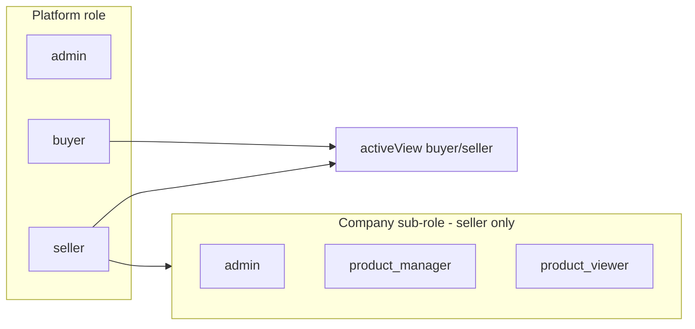

# Role-Based Sidebar Menus — Discovery & Approach

**Date:** 2026-05-18 · **Last updated:** 2026-05-18  
**Scope:** GreenBidz frontend (`101lab-2`) + backend (`101recycle-greenbidz-backend`)  
**Goal:** Let platform admins configure which sidebar items each role sees, backed by the database—not hardcoded TSX arrays.  
**Status:** Planning complete — implementation not started (see §12).

Related: [SIDEBAR_DESIGN.md](../src/components/layouts/SIDEBAR_DESIGN.md) (visual shell), [BuyerDashboardLayout.tsx](../src/components/layouts/BuyerDashboardLayout.tsx), [DashboardLayout.tsx](../src/components/layouts/DashboardLayout.tsx).

---

## 1. Executive summary

Today the product has **three separate “role” concepts** and **three hardcoded navigation trees**. Permissions exist in MySQL for **company team members** (seller sub-roles), but they only partially drive the seller sidebar—and **nothing in the DB describes menu structure**.

To let an admin configure menus we need:

1. New **navigation tables** (menu definitions + role/menu bindings).
2. **Admin CRUD APIs** to manage them.
3. A **runtime API** that returns the filtered menu for the logged-in user.
4. Frontend changes to **load menus from the API** while keeping Lucide icons and i18n on the client.
5. Hardening: mount broken permission routes, optional API enforcement so hidden nav ≠ accessible URL.

This is feasible in **phases**; phase 1 can ship seller company roles without rewriting buyer/admin in the same PR.

---

## 2. Current state (as of discovery)

### 2.1 Three role layers (do not conflate)

| Layer | Where stored | Examples | Drives |
|-------|----------------|----------|--------|
| **Platform role** | WordPress `jos_usermeta` + JWT | `admin`, `seller`, `buyer` | Which app shell you enter (`/admin`, `/dashboard`, `/buyer-dashboard`) |
| **UI mode** | `localStorage`: `activeView`, `userRole`, `jwtRole` | Buyer tab vs Seller tab | `RoleSwitcher`, route guards |
| **Company sub-role** | `jos_recycle_roles` + `jos_recycle_user_roles` | `admin`, `product_manager`, `product_viewer` | Seller permissions when `isCompanyMode === true` |



**Implication:** “Role-based menu” must declare **which layer** it keys on:

- `dashboard_type`: `seller` | `buyer` | `admin` (platform shell)
- `company_role_key`: optional, for seller company RBAC
- `platform_role`: rarely needed if `dashboard_type` is enough

### 2.2 Database (backend) — what exists

| Table | Purpose |
|-------|---------|
| `jos_recycle_permission_keys` | Catalog of feature permissions (`bidding.view`, `chat.view`, …) — seeded via `seedPermissions.js` |
| `jos_recycle_roles` | Company role catalog (`role_key`, `role_name`) |
| `jos_recycle_user_roles` | User ↔ company ↔ role assignment |
| `jos_recycle_company_role_permission_overrides` | Per-company allow/deny per permission key |

**What does not exist:** any `nav_*` / `menu_*` table, menu JSON in site content, or `GET /navigation` endpoint.

**RBAC gaps in backend:**

- `routes/permissionRoutes.js` is **not mounted** in `app.js` (and has a wrong import path).
- Permissions are returned to the client on login; **route middleware does not enforce** them consistently.
- No **default role → permission** matrix—only per-company overrides.
- `company_tax_id` column often stores **company name** (naming debt).

### 2.3 Frontend — how menus work today

| Layout | Nav source | Permission filter |
|--------|------------|-------------------|
| `DashboardLayout` (seller) | Hardcoded `navigationSections[]` | `useFilterItems()` → `useSellerPermissions()` — only 4 items use keys |
| `BuyerDashboardLayout` | Hardcoded (Overview + Account) | No-op (`permission: null` on all) |
| `AdminSidebar` | Hardcoded `NAV_SECTIONS` | None |

**Seller permission keys used in sidebar today:**

- `bidding.view`, `reports.view`, `chat.view`, `settings.view`

**Seller permission merge** (`useSellerPermissions.ts`):

1. Static `ROLE_CONFIG` in `roleConfig.ts`
2. `GET /api/v1/user/user-type-role`
3. `GET /api/v1/company-role-permissions` (when company mode)

**Normal seller** (`isCompanyMode !== true`): treated as company `admin` with full access—overrides skipped.

**No API loads menu structure**—only permission strings.

### 2.4 Permission catalog drift (fix in Phase 0)

These keys are used in the **frontend** but missing or mismatched in **`seedPermissions.js`**:

| Key | Frontend | Backend seed |
|-----|----------|--------------|
| `settings.view` / `settings.edit` | `roleConfig.ts`, seller nav | **Not seeded** |
| `userManagement.view` | `roleConfig.ts`, `useFilterItems` | Use `user.view` in seed |
| `account.view`, `support.view` | Planned buyer RBAC (§7) | **Not seeded** |

Until aligned, menu `permission_key` values must use keys that exist in **both** places, or Phase 0 must extend `seedPermissions.js`.

---

## 3. Problem statement

| Stakeholder need | Current blocker |
|------------------|-----------------|
| Admin hides “Bids” for `product_viewer` | Partially possible via `bidding.view` override, but most nav items have `permission: null` |
| Admin reorders or renames sidebar sections | Requires frontend deploy |
| Admin adds a new link for one company role | No data model |
| Buyer menu differs by “buyer tier” | No buyer RBAC in DB |
| Admin staff see different `/admin` items | Admin nav is static; no RBAC |

---

## 4. Recommended approach

### 4.1 Design principles

1. **Menus reference permissions, not replace them** — Each item has optional `permission_key`. Visibility = menu enabled for role **AND** user has permission (same `category.action` strings as today).
2. **Icons stay on the frontend** — DB stores `icon_key` (e.g. `LayoutDashboard`); client maps to Lucide components (icons cannot be serialized safely).
3. **Labels: i18n keys first** — Store `label_key` (e.g. `nav.dashboard`) not raw English, so existing `en/ja/th/zh` files keep working. Admin UI can show English default from key.
4. **Separate menu trees per dashboard** — `seller`, `buyer`, `admin` are different products surfaces; one table with `dashboard_type` column.
5. **Company overrides stay separate** — Keep `jos_recycle_company_role_permission_overrides` for feature access; menu tables define **what can appear** per role, permissions define **what user can do**.
6. **Fallback** — If API fails or returns empty, use bundled default menu (current hardcoded arrays) so the app never renders blank.
7. **Normal seller (solo)** — When `isCompanyMode !== true`, treat as full seller menu: either grant all `role_scope=company`, `role_key=admin` nav items server-side, or skip grant checks and return the full seller tree (matches today’s `useSellerPermissions` “admin” shortcut).

### 4.2 Proposed schema (new tables)

```sql
-- Menu catalog (all possible items)
CREATE TABLE jos_recycle_nav_items (
  id BIGINT PRIMARY KEY AUTO_INCREMENT,
  dashboard_type ENUM('seller','buyer','admin') NOT NULL,
  item_key VARCHAR(80) NOT NULL,           -- stable id e.g. 'seller.bids'
  label_key VARCHAR(120) NOT NULL,         -- i18n key e.g. 'nav.bidsAndWinners'
  href VARCHAR(255) NOT NULL,              -- internal path, or mailto: (v1 — validated on save)
  link_type ENUM('internal','external','mailto') NOT NULL DEFAULT 'internal',
  icon_key VARCHAR(60) NOT NULL,           -- Lucide name
  permission_key VARCHAR(100) NULL,        -- FK-ish to permission_keys; NULL = visible if menu grant allows
  parent_id BIGINT NULL,                   -- optional nesting (phase 2)
  sort_order INT NOT NULL DEFAULT 0,
  target ENUM('_self','_blank') DEFAULT '_self',
  is_active TINYINT(1) DEFAULT 1,
  created_at DATETIME,
  updated_at DATETIME,
  UNIQUE KEY uk_dashboard_item (dashboard_type, item_key)
);

-- Sections (group headers)
CREATE TABLE jos_recycle_nav_sections (
  id BIGINT PRIMARY KEY AUTO_INCREMENT,
  dashboard_type ENUM('seller','buyer','admin') NOT NULL,
  section_key VARCHAR(80) NOT NULL,
  label_key VARCHAR(120) NOT NULL,
  sort_order INT NOT NULL DEFAULT 0,
  is_active TINYINT(1) DEFAULT 1,
  UNIQUE KEY uk_dashboard_section (dashboard_type, section_key)
);

-- Which items belong to which section
CREATE TABLE jos_recycle_nav_section_items (
  section_id BIGINT NOT NULL,
  nav_item_id BIGINT NOT NULL,
  sort_order INT NOT NULL DEFAULT 0,
  PRIMARY KEY (section_id, nav_item_id)
);

-- Role → menu visibility (platform or company role)
CREATE TABLE jos_recycle_role_nav_grants (
  id BIGINT PRIMARY KEY AUTO_INCREMENT,
  role_scope ENUM('platform','company') NOT NULL,
  role_key VARCHAR(50) NOT NULL,           -- 'buyer' | 'admin' | 'product_viewer' etc.
  nav_item_id BIGINT NOT NULL,
  is_visible TINYINT(1) DEFAULT 1,
  UNIQUE KEY uk_grant (role_scope, role_key, nav_item_id)
);

-- Bumped on any nav/section/grant change; clients send If-None-Match / ?version=
CREATE TABLE jos_recycle_nav_config_meta (
  id TINYINT PRIMARY KEY DEFAULT 1,
  menu_version INT NOT NULL DEFAULT 1,
  updated_at DATETIME NOT NULL
);
```

**Href validation (v1):**

- `link_type=internal` → `href` must exist in shared allow-list (mirror `App.tsx` routes).
- `link_type=mailto` → `href` must start with `mailto:` (buyer Contact Support).
- `link_type=external` → `https?://` only; phase 2 if needed.

**Allow-list source of truth:** `101lab-2/src/config/navRouteAllowlist.ts` (export paths array; backend imports copy or shared JSON in monorepo later).

**Optional phase 2:** `company_nav_overrides` (same shape as permission overrides) for per-tenant menu tweaks.

**Seed strategy:** Migration script copies **current** `DashboardLayout` / `BuyerDashboardLayout` / `AdminSidebar` items into `nav_items` + default grants for all roles (parity with today).

### 4.3 API surface

| Method | Path | Auth | Purpose |
|--------|------|------|---------|
| `GET` | `/api/v1/navigation/me?dashboard=seller` | User JWT | Resolved menu for current user (filtered by role + permissions + account status) |
| `GET` | `/api/v1/admin/navigation?dashboard=seller` | Admin | Full tree for editor |
| `PUT` | `/api/v1/admin/navigation/sections/:id` | Admin | Update section label/order |
| `PUT` | `/api/v1/admin/navigation/items/:id` | Admin | Update item href, permission, icon, active |
| `PUT` | `/api/v1/admin/navigation/role-grants` | Admin | Bulk set visibility matrix (role × item) |
| `POST` | `/api/v1/admin/navigation/seed` | Admin | Idempotent seed from defaults |

- Admin API must validate `href` + `link_type` against rules in §4.2 (allow-list / mailto prefix).
- Sections with **no visible items** after grant + permission + account-status filtering are **omitted** from `/navigation/me` (do not return empty section headers).
- Response includes `menuVersion` (from `nav_config_meta`) for RTK cache invalidation; client sends `?version=` or uses `providesTags: ['Navigation', menuVersion]`.

**Resolution order for each item:**

1. `is_active` on item + section  
2. `role_nav_grants` for user’s resolved role (`company` scope + `role_key`, or `platform` for buyer/admin)  
3. Normal seller shortcut (§4.1 #7) if applicable  
4. User `permissions[]` (hide if `permission_key` set and not allowed)  
5. Account status → `restricted: true` or hide per product rule  

**`GET /navigation/me` response shape (matches frontend `NavSection[]`):**

```json
{
  "dashboard": "seller",
  "sections": [
    {
      "sectionKey": "selling",
      "labelKey": "nav.selling",
      "items": [
        {
          "itemKey": "seller.dashboard",
          "labelKey": "nav.dashboard",
          "href": "/dashboard",
          "iconKey": "LayoutDashboard",
          "permissionKey": null,
          "target": "_self",
          "badge": null
        }
      ]
    }
  ],
  "permissions": ["bidding.view", "chat.view"],
  "menuVersion": 3
}
```

Server should apply the same allow-list logic as `computeRestricted()` in `sidebar/helpers.ts` for pending accounts, or return per item `"restricted": true` (click opens modal; same as today).

### 4.4 Frontend integration

| Step | File / area | Change |
|------|-------------|--------|
| 1 | `rtk/slices/navigationApiSlice.ts` | `useGetNavigationQuery({ dashboard: 'seller' })` |
| 2 | `sidebar/iconRegistry.ts` | `Record<string, LucideIcon>` |
| 3 | `sidebar/mapApiMenu.ts` | API JSON → `NavSection[]` + `t(labelKey)` |
| 4 | `DashboardLayout.tsx` | Replace inline array with query + fallback defaults |
| 5 | `useFilterItems` | Unchanged if `permission` field still populated |
| 6 | `BuyerDashboardLayout.tsx` | Same pattern, `dashboard: 'buyer'` |
| 7 | `AdminSidebar.tsx` | Migrate to shared `NavItem` + API; later add admin RBAC |
| 8 | Admin UI page | New `AdminNavigation.tsx` — matrix editor (roles × items) |

**RTK cache invalidation:** On company switch (`CompanySelector`), refetch `navigation/me` + `user-type-role`.

### 4.5 Admin UI (product)

Suggested location: **Admin → Settings → Navigation** (or under existing Permissions if you add `admin.permissions` gate).

Screens:

1. **Dashboard picker** — Seller / Buyer / Admin
2. **Section list** — drag reorder, edit `label_key`
3. **Items per section** — href, icon picker (dropdown of allowed keys), permission dropdown (from `permission_keys` table)
4. **Role matrix** — rows depend on dashboard picker:

   | Dashboard | Matrix rows (`role_scope` + `role_key`) |
   |-----------|----------------------------------------|
   | **Seller** | `company` × `admin`, `product_manager`, `product_viewer` (not platform `seller`) |
   | **Buyer** | `platform` × `buyer` only (until buyer tiers exist) |
   | **Admin** | `platform` × `admin` only (until admin sub-roles exist) |

5. **Preview** — optional read-only mock sidebar

Use existing patterns from `AdminSiteContent` (groups/items/reorder) as UX reference—not the same tables, but similar admin mental model.

---

## 5. Phased rollout

### Phase 0 — Fix foundation (1–2 days)

- [ ] Mount and fix `permissionRoutes` in `app.js` (correct import: `controller/permissionController.js`)
- [ ] Align `roleConfig.ts` ↔ `seedPermissions.js` ↔ sidebar keys (see §2.4 — add `settings.*`, map `userManagement.*` → `user.*`)
- [ ] Add `src/config/navRouteAllowlist.ts` from `App.tsx` routes
- [ ] Document platform vs company role for the team (§2.1 — **done in this doc**)
- [ ] Add missing `permission` on **static** seller nav items per §7 (`product.view`, `batch.view`, …)

### Phase 1 — DB + seller menu API (1 week)

- [ ] Sequelize models + migration SQL for nav tables
- [ ] Seed from current `DashboardLayout` nav
- [ ] `GET /navigation/me?dashboard=seller`
- [ ] Admin CRUD for items + role grants (minimal)
- [ ] Frontend: seller layout loads from API with static fallback

### Phase 2 — Buyer + admin menus (3–5 days)

- [ ] Seed buyer/admin nav
- [ ] Wire `BuyerDashboardLayout` + unify `AdminSidebar` on `NavItemLink`
- [ ] Admin navigation editor UI

### Phase 3 — Company overrides + enforcement (1 week)

- [ ] Optional `company_nav_overrides`
- [ ] API middleware: deny requests when permission missing (align with nav)
- [ ] Route guards in `App.tsx` generated from same permission keys

### Phase 4 — Polish

- [ ] Menu change audit log
- [ ] Version/publish workflow (draft menu vs live)
- [ ] Per-locale label overrides in DB (only if i18n keys are insufficient)

---

## 6. Key decisions (need product sign-off)

| # | Question | Recommendation |
|---|----------|----------------|
| 1 | Configure menus per **company role** only, or also **platform** buyer/seller/admin? | Both: `role_scope` column; start with `company` + `platform` for buyer/admin |
| 2 | Can admin create **new routes** not in codebase? | **No** for v1 — href must match registered React routes (validate on save) |
| 3 | Hide vs disable menu for missing permission? | **Hide** (current behavior); optional “locked” state later |
| 4 | Who can edit menus? | Platform `admin` only; company admins edit permissions only (existing overrides) |
| 5 | Single menu for buyer when `activeView=seller`? | Menus keyed off **route shell** (`dashboard_type`), not `activeView` |

---

## 7. Mapping today’s nav → permission keys (seller)

| Nav item (current) | Suggested `permission_key` |
|--------------------|----------------------------|
| Dashboard | `null` or `product.view` |
| List an Item / Bulk Upload | `product.create` |
| My Listings | `product.view` |
| Bids & Winners | `bidding.view` ✓ |
| Auction Groups | `batch.view` |
| Offers & Orders | `order.view` |
| Deal Reports | `reports.view` ✓ |
| Chat | `chat.view` ✓ |
| Settings | `settings.view` ⚠️ frontend only — **seed in Phase 0** |
| Users / Permissions (missing from nav) | `user.view` / `admin.permissions` |

**Buyer menu (static today —** [BuyerDashboardLayout.tsx](../src/components/layouts/BuyerDashboardLayout.tsx)**):**

| Item | href | Suggested `permission_key` (Phase 2+) |
|------|------|--------------------------------------|
| Dashboard | `/buyer-dashboard` | `null` |
| Watchlist | `/my-lots` | `null` or future `watchlist.view` |
| Settings | `/buyer/profile-setting` | `account.view` ⚠️ seed in Phase 0/2 |
| Chat | `/buyer/chat/message` | `chat.view` ✓ |
| Contact Support | `mailto:support@greenbidz.com` | `null` or `support.view` — **no permission gate for mailto in v1** |

---

## 8. Risks

| Risk | Mitigation |
|------|------------|
| Menu visible but API 403 | Phase 3 middleware; keep route guards |
| Drift between DB href and React routes | Allow-list validator in admin API |
| i18n missing key | Fallback to `label_key` string; CI check keys exist in `en.json` |
| Performance | RTK cache keyed on `menuVersion`; refetch on company switch + after admin publish |
| Admin breaks production menu | `is_active` + seed restore endpoint; optional `published_at` |
| Three role systems confuse grants | Admin UI labels: “Platform role” vs “Company role (seller team)” |

---

## 9. What not to do

- **Do not** store React component names as executable code in DB.
- **Do not** use `site-content` tables for navigation—they are CMS copy blocks.
- **Do not** replace permission overrides with menu grants alone—users would see links they cannot use (or miss links they can use).
- **Do not** block phase 1 on full admin UI polish—a JSON/matrix MVP is enough.

---

## 10. Immediate next steps (engineering)

1. **Product workshop** — Confirm dashboards (seller/buyer/admin) and which roles get a matrix.
2. **Backend PR** — Nav tables + seed + `GET /navigation/me` for seller only.
3. **Frontend PR** — `mapApiMenu` + seller layout behind feature flag `VITE_DYNAMIC_NAV=1`.
4. **Align permission catalog** — Run audit: `seedPermissions.js` ↔ `roleConfig.ts` ↔ sidebar `permission` fields.
5. **Fix** unmounted `permissionRoutes` so admin can manage keys that menus reference.

---

## 11. File reference index

### Backend (`101recycle-greenbidz-backend`)

- `models/role.model.js`, `userRole.model.js`, `permission.model.js`, `companyRolePermission.model.js`
- `services/userService.js` — `getUserTypeAndRoleDetails`
- `services/companyRolePermissionService.js`
- `seedPermissions.js`
- `routes/roleRoutes.js`, `companyRolePermissionRoutes.js`, `userRoutes.js`
- `routes/permissionRoutes.js` — **unmounted**
- `routes/adminRoute.js` — operational admin, no nav CRUD

---

## 12. Progress tracker

- [x] Discovery and problem analysis completed.
- [x] Current state audit written, including role layers and frontend/backend gaps.
- [x] Recommended schema, API surface, and frontend integration plan added.
- [x] Phase rollout and risk mitigation sections documented.
- [x] Progress/status markers added to the doc.
- [ ] Backend implementation started.
- [ ] Phase 0 fixes applied in codebase.
- [ ] Seller `GET /navigation/me` API implemented.
- [ ] Frontend dynamic menu loading implemented.
- [ ] Buyer/admin menu migration started.
- [ ] Admin navigation editor UI built.

**Current status:** planning complete, doc ready for execution; Phase 0 implementation not started.

### Frontend (`101lab-2`)

- `src/hooks/useSellerPermissions.ts`
- `src/config/roleConfig.ts`
- `src/components/layouts/sidebar/helpers.ts` — `useFilterItems`, `computeRestricted`
- `src/components/layouts/DashboardLayout.tsx`
- `src/components/layouts/BuyerDashboardLayout.tsx`
- `src/components/layouts/AdminSidebar.tsx`
- `src/components/common/RoleSwitcher.tsx`
- `src/components/common/CompanySelector.tsx`
- `src/config/navRouteAllowlist.ts` — **to create** (Phase 0)

---

## 12. Implementation progress

Durable log. Update checkboxes as work lands.

### Planning & discovery

- [x] **P1.** Backend + frontend role/menu discovery documented (§2–3).
- [x] **P2.** Schema, APIs, and phased rollout drafted (§4–5).
- [x] **P3.** User review: href validation, empty-section omission, buyer permission notes incorporated.
- [x] **P4.** Doc fixes: `link_type`, `menu_version`, permission drift table (§2.4), normal-seller rule, admin matrix rows, buyer nav table (§7).

### Related frontend work (static nav — not dynamic RBAC yet)

- [x] **F1.** Shared sidebar components (`NavItemLink`, `SectionHeader`, `sidebarStyles`, design tokens).
- [x] **F2.** Buyer sidebar restructured: Overview (Dashboard, Watchlist) + Account (Settings, Chat, Contact Support) — hardcoded.
- [x] **F3.** Seller/buyer layouts use `bg-sidebar` / app CSS variables (aligned with codebase).
- [ ] **F4.** Seller nav items wired with full §7 `permission_key` set (still mostly `null` in `DashboardLayout.tsx`).

### Phase 0 — Foundation

- [ ] Mount `permissionRoutes` in backend `app.js`
- [ ] Permission catalog alignment (`seedPermissions.js` ↔ `roleConfig.ts`)
- [ ] `navRouteAllowlist.ts` + mailto validation rules documented in admin API

### Phase 1 — Seller dynamic menu

- [ ] DB migration + Sequelize models for nav tables
- [ ] Seed seller nav from `DashboardLayout.tsx`
- [ ] `GET /api/v1/navigation/me?dashboard=seller`
- [ ] Admin minimal CRUD + role grants API
- [ ] Frontend `navigationApiSlice` + `VITE_DYNAMIC_NAV` flag on seller layout

### Phase 2 — Buyer + admin

- [ ] Seed buyer/admin nav; wire layouts
- [ ] Admin navigation matrix UI

### Phase 3 — Enforcement

- [ ] API permission middleware
- [ ] Optional `company_nav_overrides`

### Phase 4 — Polish

- [ ] Audit log, draft/publish, locale overrides

### Validation (run when Phase 1+ ships)

- [ ] `product_viewer` sees reduced seller menu per matrix
- [ ] Solo seller sees full menu (normal-seller rule)
- [ ] Pending account: restricted routes flagged; allow-list routes work
- [ ] Admin edits menu → `menuVersion` bumps → clients refetch
- [ ] Invalid `href` rejected on admin save

---

*This document is a planning artifact. Implementation should follow phased PRs above rather than a single large change.*
